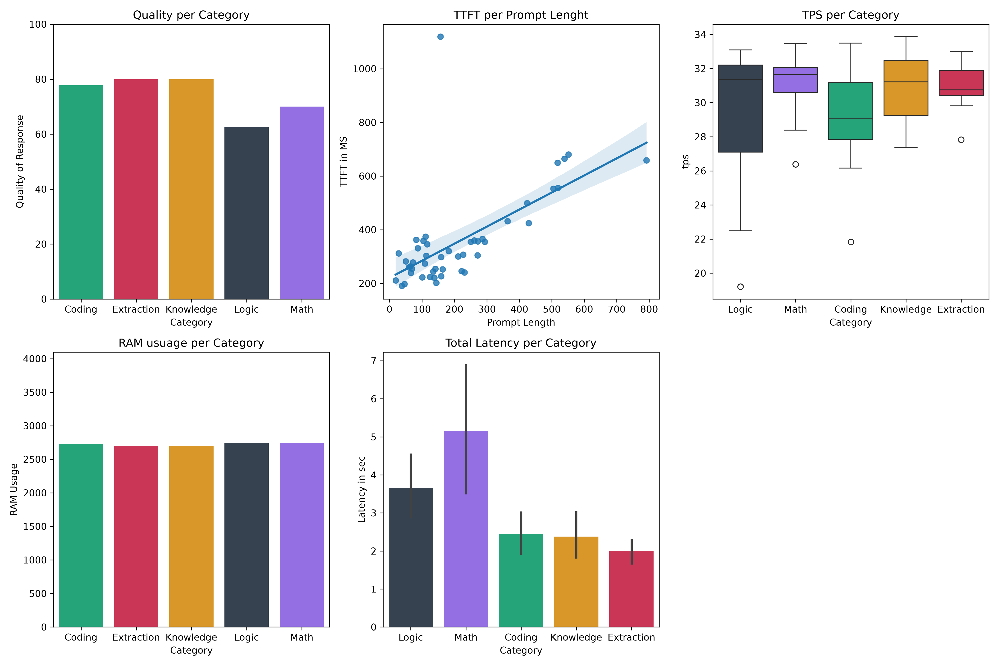
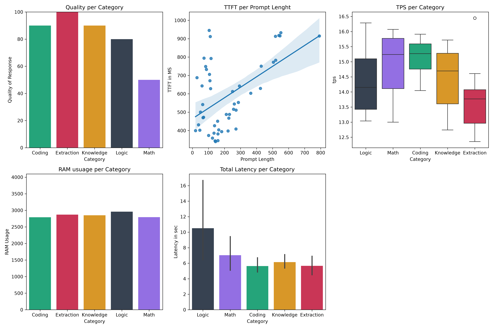
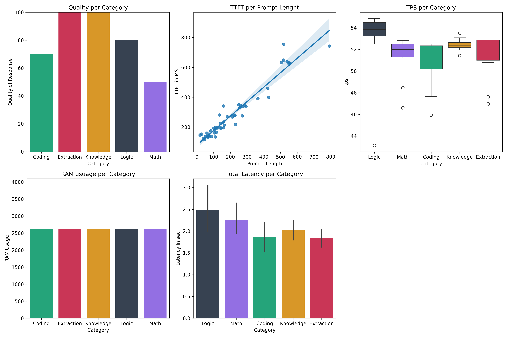

# LOCAL LLM BENCHMARK
This repo is a benchmark suite for edge-case performance and quality for **locally run LLMs** using Ollama.

## HARDWARE SPECIFICATION
- **CPU:** Intel Core i5-9300H
- **GPU:** NVIDIA GeForce GTX 1650 Ti (4GB VRAM)
- **RAM:** 8GB System Memory

## MODELS USED
- `llama3.2:3b`
- `phi4-mini:3.8b`
- `qwen2.5:3b`

Used **Q4 quantized** versions for this particular benchmark, but the suite supports all kinds of models and uses Ollama as the inference engine.

## INSTALLATION GUIDE
To run the suite, you must install the models you wish to benchmark.
- First, download and install Ollama on your system from the [official website](https://ollama.com/download).
- Then, open PowerShell as an administrator and type: `ollama run "your model name"`
    - Replace `"your model name"` with the exact model tag (e.g., `llama3.2:3b`).
    - Check out available models on the official Ollama library.

## SCRIPT GUIDE
- Clone this repo into your workspace.
- Change the model name in this function inside `main.py`:
  ```python
  benchmark("your_model_name", "prompt_set.csv")
  ```
- Run `main.py`.
- You can also add or change the default prompt set. Just make sure to follow this CSV header pattern: `question_id, category, prompt, expected_output`.

## METRICS MEASURED
- **TTFT (Time To First Token)**
    - How much time the prefill phase of the inference takes, measured in milliseconds.
- **TPS (Tokens Per Second)**
    - How many tokens are generated per second per prompt during the decode phase.
- **Response Latency**
    - Measures the total time taken between the user submitting the query and receiving the final response, measured in seconds.
- **RAM Usage**
    - Peak memory used by the model during inference, measured in MB.
- **Quality of Responses**
    - Measures the accuracy percentage of the model's correct answers.

## PROMPT CATEGORIES
The benchmark is divided into 5 categories:

| Category | Description | 
| -------- | ----------- |
| **Logic** | Multi-step deductions and positional puzzles |
| **Math** | Multi-step arithmetic and word problems |
| **Coding** | Syntax fixes, Big-O analysis, and expressions |
| **Knowledge** | Factual retrieval and history/science domain Q&A |
| **Data Extraction** | Regex, entity parsing, and JSON key extraction |

- You can add more categories by:
    - First, adding them to the `category` column in your prompt set CSV.
    - Second, assigning a Hex code in this `main.py` dictionary:
    ```python
    colour_pallet = {...}
    ```

## KEY VISUALS
### Llama


### Phi


### Qwen


## IMPORTANT
After running `main.py`, make sure to copy `benchmark.csv` and `visuals.png` into another folder, as they will be overwritten on the next run of the script.

# THANK YOU